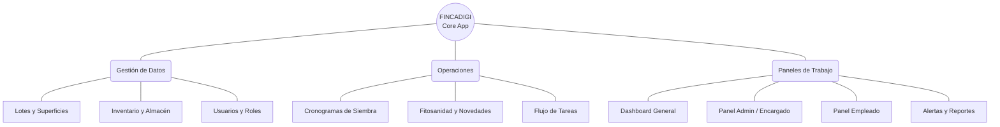

# Carta Estructural del Sistema Fincadigi

Este documento describe la arquitectura técnica, los módulos operativos y los flujos de negocio del sistema **Fincadigi**, reflejando las actualizaciones más recientes del proyecto.

---

## 1. Arquitectura y Stack Tecnológico

El sistema está construido como una Single Page Application (SPA) reactiva con servicios en la nube en tiempo real.

*   **Frontend:** React (Vite) + CSS Modules (Estética minimalista y moderna).
*   **Base de Datos (BaaS):** Firebase Firestore (Tiempo real, NoSQL).
*   **Autenticación:** Firebase Authentication (Email/Password).
*   **Almacenamiento de Medios:** Cloudinary API (Subida de fotos de evidencia y monitoreo).
*   **APIs Externas:** Open-Meteo API (Clima local en tiempo real y pronóstico de lluvia gratuito).
*   **Hosting:** Netlify (Despliegue continuo).

---

## 2. Mapa Conceptual (Módulos Principales)

---

## 3. Árbol de Navegación por Rol

El sistema filtra dinámicamente la barra lateral (`Sidebar.jsx`) dependiendo del rol del usuario (`admin`, `encargado`, `empleado`).

### Módulos Comunes
*   **Dashboard (`/`):** Vista rápida con clima, distribución de cultivos, gráficas de consumo de insumos y accesos rápidos.
*   **Lotes (`/lotes`):** Registro de terrenos, áreas y cultivos sembrados.
*   **Siembras (`/siembras`):** Planificación inteligente. Calcula fechas estimadas de fases vegetativas y de cosecha. *(Los empleados solo pueden ver, no crear ni editar).*
*   **Inventario (`/inventario`):** Catálogo de insumos agrícolas con control de stock y umbrales mínimos.
*   **Monitoreo (`/monitoreo`):** Feed global de captura de evidencias fotográficas. Permite reportar estado de cultivos, fallas de infraestructura o plagas, registrar al autor y permite al admin marcar como "Visto".

### Módulos Exclusivos (Super Admin / Encargado)
*   **Panel de Control (`/paneladmin`):** Semáforo de tareas, aprobación de excepciones de insumos, creación de correctivas y reasignación de fechas.
*   **Historial (`/historial`):** Reportes en tabla con filtros semanales/mensuales de tareas finalizadas, exportables a PDF y Excel.
*   **Alertas (`/alertas`):** Notificaciones preventivas de stock agotado, abonos atrasados y cosechas próximas.
*   **Usuarios (`/usuarios`):** Creación y asignación de roles a empleados.

### Panel Exclusivo (Empleado)
*   **Mis Tareas (`/panelempleado`):** Vista Kanban simplificada. El empleado ve sus tareas asignadas y puede completarlas adjuntando foto e insumos.

---

## 4. Ciclo de Vida de las Tareas (State Machine)

El motor principal de Fincadigi es su sistema de gestión de tareas agronómicas. El ciclo de vida de una tarea es el siguiente:

1.  **Generado:** La tarea es creada por el algoritmo de siembras o manualmente, pero aún no tiene un trabajador asignado.
2.  **Asignado:** El Admin asigna a un empleado. La tarea aparece en el panel del operario.
3.  **Ejecutado (Por Revisar):** El empleado completa la tarea, descuenta insumos y sube evidencia. Espera revisión.
4.  **Validado (Completada):** El Encargado o Admin revisa la evidencia y aprueba la labor. Pasa al historial definitivo.

### Excepciones en el Flujo
*   **Atraso Reportado:** Si la fecha límite (`fechaSugerida`) se vence, la tarea se bloquea para el empleado. El empleado debe justificar el atraso con un motivo (ej. Lluvia, Falta de insumos). El Admin lo revisa y le asigna una **Nueva Fecha**, volviendo al estado *Asignado*.
*   **Insumos Extra (Ad-Hoc):** Si un empleado usa un insumo que no está en la tarea, se genera una excepción. El Admin debe aprobarla para que se descuente del inventario.

---

## 5. Próximos Pasos Arquitecturales
*   **Automatización Backend:** Implementación de Firebase Cloud Functions (CRON Jobs) para disparar correos diarios de alertas y resúmenes al administrador a las 7:00 AM.
